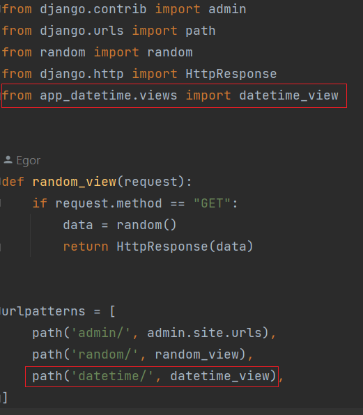
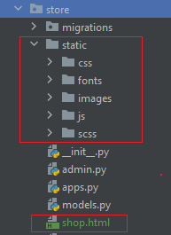
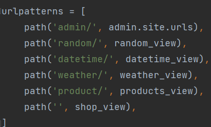

Руководство и задания к 2-ой практике. На практике поработаем с проектом Django, 
создадим приложения и представления. Поработаем с выводом HTML файлов через Django.

В работе будем заниматься созданием проекта "Магазин", знакомством со структурой проекта Django и
настройкой представлений 

#### 1. Создайте проект `project` (так будет называться папка в которой создастся файлы для основного управления приложением)

В консоли пропишите команду (убедиться, что находитесь в папке проекта)

`django-admin startproject project .`

`.` ставится в конце, для создания проекта внутри корневой папки, без создания новой папки для Django приложения

#### 2. Исследуйте созданные файлы проекта


#### 3. Запустите сервер приложений

`python manage.py runserver`

Если всё удачно, то зайдите на локальный хост http://127.0.0.1:8000/ , где будет развернуто ваше приложение.

Приложение выглядит совсем пустым, поэтому напишем пару представлений

#### 4. Напишем представление для получения случайного числа от сервера

Так как это достаточно простое действие, то напишем его в файле `urls.py` папки `project`

В `urls.py` обычно прописывают маршруты по которым будут обрабатываться определенные представления.

В `urls.py` к стандартному коду пропишем (можно скопировать или переписать)

```python
from random import random
from django.http import HttpResponse

def random_view(request):
    if request.method == "GET":
        data = random()
        return HttpResponse(data)
```

Функция представления обязательно должна что-то возвращать. Чаще всего она возвращает объект `HttpResponse`

Строка `request.method == "GET"` разграничивает код отображения для выполнения запроса `GET` (вспоминаем разные типы запросов)

Однако после написания данного представления чуда не произойдёт и Django приложение ничего не обработает, так как необходимо
сказать по какому маршруту будет обрабатываться данное представление. Для этого есть в `urls.py` есть переменная `urlpatterns`,
из которой Django приложение берет информацию о маршрутах обработки представлений.

Создадим маршрут для обработки представления. Первая переменная отвечает за маршрут, а вторая за обработчик который будет 
вызван в случае совпадения маршрута

`path('random/', random_view),`

Добавим маршрут к `urlpatterns`

В итоге общий код в `urls.py` будет таким


Зайдём на http://127.0.0.1:8000/ и получим следующую картинку, где видно, что есть определенные маршруты по которым 
можно перейти 


Допишем в адресную строку `/random/` и перейдем или перейдем сразу по http://127.0.0.1:8000/random/

Теперь при обновлении страницы каждый раз будет показываться новое случайное значение.


#### 5. Напишем представление для получения текущего времени от сервера

Постоянно прописывать весь код в одном файле бывает удобно, до тех пор пока кода будет не слишком много, поэтому в Django
есть механизм позволяющий разделить ваше приложение на определенные изолированные папки (мини-приложения).

Воспользуемся данным механизмом и создадим приложение `app_datetime` (необязательно для этого останавливать сервер(
по команде `Ctrl+C` в консоле, где запущен сервер), можно просто нажать на `+` в терминале и вызвать новую консоль где
прописать команду)

`python manage.py startapp app_datetime`

Теперь создалась папка с названием `app_datetime`

На данном этапе из `app_datetime` понадобится файл `views.py` в котором подразумевается нахождение представлений данного 
мини-приложения. 

По предложенному шаблону заполните функцию представление во `views.py`. Для получения текущей даты и времени можно вызвать метод `now` 
у `datetime`

```python
from django.http import HttpResponse
from datetime import datetime


def datetime_view(request):
    if request.method == "GET":
        data = ...  # Написать, что будет возвращаться из данного представления
        # Вернуть объект HttpResponse с необходимыми данными
```

Далее уже по предыдущему примеру создадим маршрут, импортировав представление в `urls.py` 
в папке `project`. Не забудем импортировать представление.



Существует правило, что после создания приложения его необходимо зарегистировать 
в переменной `INSTALLED_APPS` файла `settings.py` папки `project`. Это необходимо
для определенных механизмов Django для работы с приложениями.


Далее через основной адрес можно будет посмотреть по каким маршрутам можно перейти


По маршруту http://127.0.0.1:8000/datetime/ можно будет посмотреть текущее время


#### 6. Самостоятельно напишите представление для отображения данных о погоде(используя ранее изученную API погоды)

Общие шаги будут следующие:

1. Создайте приложение `app_weather`.


2. Зарегистрируйте его в `INSTALLED_APPS`.


3. Во `views.py ` приложения создайте представление возвращающее данные о погоде. Используйте функцию `current_weather` 
написанную ранее в `weather_api.py`. Функцию импортируйте. В функцию передайте постоянное значение географических 
координат (в следующих практиках поправим данный момент) для предоставления информации о погоде.
Верните JSON объект и сделайте отображение кириллических символов и отступов.

Например

```python
from django.http import JsonResponse

def my_view(request):
    if request.method == "GET":
        data = {...}  # Результат работы функции current_weather
        # А возвращаем объект JSON. Параметр json_dumps_params используется, чтобы передать ensure_ascii=False
        # как помните это необходимо для корректного отображения кириллицы
        return JsonResponse(data, json_dumps_params={'ensure_ascii': False,
                                                     'indent': 4})
```

4. Зарегистрируйте данный маршрут `weather/` в корневом `urls.py`. На примере прошлого приложения.


5. Проверьте работоспособность вашего приложения как ручным методом (перейти по адресу в браузере как пример 
http://127.0.0.1:8000/weather/ ), так и с помощью модуля `requests` (как на первой практике).


#### 7. Работа с данными магазина

Далее сделаем возможность подключения к базе товаров нашего магазина. База оформлена в виде словаря.

1. Создадим новое приложение `store`


2. Зарегистрируйте его в `INSTALLED_APPS`.


3. В файле `models.py` приложения `store` сформируем базу товаров (скопируем из кода ниже и вставим в `models.py`)

```python utf-8
DATABASE = {'1': {'name': 'Болгарский перец',
                  'discount': 30,
                  'price_before': 300.00,
                  'price_after': 210.00,
                  'description': 'Сочный и яркий, он добавит красок и вкуса в ваши блюда.',
                  'rating': 4.9,
                  'review': 250,
                  'sold_value': 600,
                  'weight_in_stock': 500,
                  'category': 'Овощи',
                  'id': 1,
                  'url': 'store/images/o-1.jpg',
                  'html': 'bell_pepper'
                  },
            '2': {'name': 'Клубника',
                  'discount': None,
                  'price_before': 500.00,
                  'price_after': 500.00,
                  'description': 'Сладкая и ароматная клубника, полная витаминов, чтобы сделать ваш день ярче.',
                  'rating': 5.0,
                  'review': 200,
                  'sold_value': 700,
                  'weight_in_stock': 400,
                  'category': 'Фрукты',
                  'id': 2,
                  'url': 'store/images/o-2.jpg',
                  'html': 'strawberry'
                  },
            '3': {'name': 'Стручковая фасоль',
                  'discount': None,
                  'price_before': 250.00,
                  'price_after': 250.00,
                  'rating': 4.8,
                  'review': 250,
                  'sold_value': 500,
                  'weight_in_stock': 500,
                  'description': 'Зеленая натуральность и богатство белка для вашей здоровой диеты.',
                  'rating': 5.0,
                  'review': 100,
                  'sold_value': 500,
                  'weight_in_stock': 600,
                  'category': 'Овощи',
                  'id': 3,
                  'url': 'store/images/o-3.jpg',
                  'html': 'green_beans'
                  },
            '4': {'name': 'Краснокочанная капуста',
                  'discount': None,
                  'price_before': 90.00,
                  'price_after': 90.00,
                  'description': 'Удивите своих гостей экзотическим вкусом и цветом ваших блюд.',
                  'rating': 4.7,
                  'review': 30,
                  'sold_value': 50,
                  'weight_in_stock': 300,
                  'category': 'Овощи',
                  'id': 4,
                  'url': 'store/images/o-4.jpg',
                  'html': 'purple_cabbage'
                  },
            '5': {'name': 'Помидоры',
                  'discount': 25,
                  'price_before': 240.00,
                  'price_after': 180.00,
                  'description': 'Свежие и сочные помидоры для идеальных салатов и соусов.',
                  'rating': 4.9,
                  'review': 350,
                  'sold_value': 700,
                  'weight_in_stock': 300,
                  'category': 'Овощи',
                  'id': 5,
                  'url': 'store/images/o-5.jpg',
                  'html': 'tomatoes'
                  },
            '6': {'name': 'Брокколи',
                  'discount': None,
                  'price_before': 320.00,
                  'price_after': 320.00,
                  'description': 'Здоровье в каждом кусочке, чтобы укрепить вашу иммунную систему.',
                  'rating': 4.9,
                  'review': 150,
                  'sold_value': 250,
                  'weight_in_stock': 300,
                  'category': 'Овощи',
                  'id': 6,
                  'url': 'store/images/o-6.jpg',
                  'html': 'broccoli'
                  },
            '7': {'name': 'Морковь',
                  'discount': None,
                  'price_before': 50.00,
                  'price_after': 50.00,
                  'description': 'Красота и здоровье для ваших глаз и кожи в каждой моркови.',
                  'rating': 4.8,
                  'review': 220,
                  'sold_value': 800,
                  'weight_in_stock': 900,
                  'category': 'Овощи',
                  'id': 7,
                  'url': 'store/images/o-7.jpg',
                  'html': 'carrots'
                  },
            '8': {'name': 'Фруктовый сок',
                  'discount': None,
                  'price_before': 120.00,
                  'price_after': 120.00,
                  'description': 'Натуральная свежесть и энергия в каждом глотке.',
                  'rating': 4.9,
                  'review': 300,
                  'sold_value': 800,
                  'weight_in_stock': 1200,
                  'category': 'Соки',
                  'id': 8,
                  'url': 'store/images/o-8.jpg',
                  'html': 'fruit_juice'
                  },
            '9': {'name': 'Лук',
                  'discount': 20,
                  'price_before': 40.00,
                  'price_after': 32.00,
                  'description': 'Придайте особый аромат и вкус вашим блюдам с нашим свежим луком.',
                  'rating': 4.6,
                  'review': 80,
                  'sold_value': 170,
                  'weight_in_stock': 350,
                  'category': 'Овощи',
                  'id': 9,
                  'url': 'store/images/o-9.jpg',
                  'html': 'onion'
                  },
            '10': {'name': 'Яблоки',
                   'discount': None,
                   'price_before': 130.00,
                   'price_after': 130.00,
                   'description': 'Сочные и сладкие яблоки - идеальная закуска для здорового перекуса.',
                   'rating': 4.7,
                   'review': 30,
                   'sold_value': 70,
                   'weight_in_stock': 200,
                   'category': 'Фрукты',
                   'id': 10,
                   'url': 'store/images/o-10.jpg',
                   'html': 'apple'
                   },
            '11': {'name': 'Чеснок',
                   'discount': None,
                   'price_before': 150.00,
                   'price_after': 150.00,
                   'description': 'Секрет вкусных блюд и поддержания здоровья вашего сердца.',
                   'rating': 4.9,
                   'review': 150,
                   'sold_value': 400,
                   'weight_in_stock': 1000,
                   'category': 'Овощи',
                   'id': 11,
                   'url': 'store/images/o-11.jpg',
                   'html': 'garlic'
                   },
            '12': {'name': 'Перец Чили',
                   'discount': None,
                   'price_before': 400.00,
                   'price_after': 400.00,
                   'description': 'Острая страсть для тех, кто ищет приключения на своей тарелке.',
                   'rating': 5.0,
                   'review': 40,
                   'sold_value': 300,
                   'weight_in_stock': 50,
                   'category': 'Овощи',
                   'id': 12,
                   'url': 'store/images/o-12.jpg',
                   'html': 'chilli'
                   },
            }
```

4. Во `views.py` создадим представление возвращающее все товары как объект JSON из базы данных. 


```python
from django.http import JsonResponse
from .models import DATABASE


def products_view(request):
    if request.method == "GET":
        return  # Вернуть JsonResponse с объектом DATABASE и параметрами отступов и кодировок,
        # как в приложении app_weather
```

4. Регистрируем путь для обработчика в корневой `urls.py`, по пути `product/`


5. Проверяем работоспособность


#### 8. Рендер HTML файлов

В папке `files/lab2` есть html документ `shop.html` приближенный к реальному html документу - это одна из страниц
шаблона магазина овощей и фруктов. Откройте этот файл через браузер или превью PyCharm.

Данный файл никак не обрабатывается Django. Пропишем представление, которое будет возвращать
этот HTML файл. Для этого:

1. Скопируем `shop.html` и папку `static` в приложение `store`.




2. Создадим представление, которое будет возвращать HTML шаблон.

Возвращением HTML шаблона с подставлением данных в шаблон занимается метод `render`
из `django.shortcuts` 

Во `views.py` приложения `store` пропишем

```python
from django.http import HttpResponse

def shop_view(request):
    if request.method == "GET":
        with open('store/shop.html', encoding="utf-8") as f:
            data = f.read()  # Читаем HTML файл
        return HttpResponse(data)  # Отправляем HTML файл как ответ
```

3. В `urls.py` пропишите маршрут к представлению. Чтобы 
рассматриваемый HTML файл подгружался сразу при входе на сайт, то можно прописать
путь с пустой строкой, такой как

`path('', shop_view),`



4. Проверьте, что всё отрабатывает корректно при входе на главную страницу сайта.

Страница должна выглядеть так


### Практика окончена

Зафиксируем изменения сделав коммит и отправим эти коммиты на github